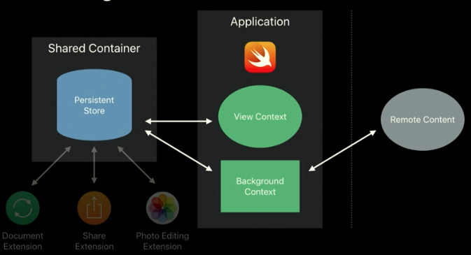
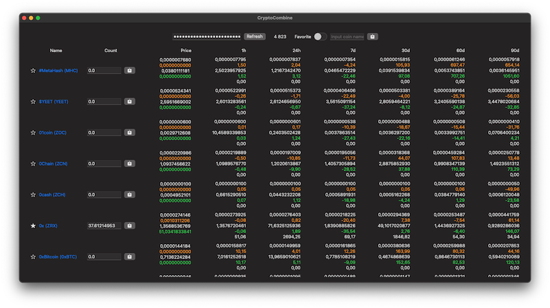

# CryptoCombine

### macOS version is under development, iOS version will come in the future

The next version will be emplemented Core Data (Server->CoreData->SwiftUI)

This project was created to show how simple and effective it is to use local storage to optimize CPU, memoty, bandwidth usage. Have a powerful and flexible way for working with data that comes from the server in JSON format. Be able to cache requests from the server. And the ability to save this data to iCloud.
Subscribe to keep track of new commits. 

Ideas from these sources: 
[Optimizing Storage in Your App](https://developer.apple.com/videos/play/wwdc2019/419) 2019 
[Core Data: Sundries and maxims](https://developer.apple.com/videos/play/wwdc2020/10017) 2020 

